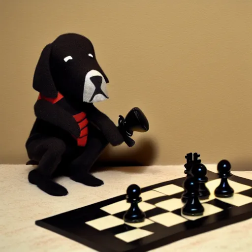

# Tofiks UCI chess engine - Yes, I am a dog and, yes, I play chess. Get over it!

## Installation
Latest stable version 64-bit binaries can be found in the release section.
### Compile yourself
* Clone repository or copy files
* Make sure you have Golang 1.19+ installed
* `make build` will compile it your native architecture.
* In the Makefile you can change the `GOAMD64VERSION` variable. The values range from v1 to v4 and include various sets of extended instructions. A higher v-value should be expected to have better performance but might have more specific architecture and instruction set extension requirements. Most modern CPUs should be AVX2 compatible which is v3, v4 requires AVX512 support. 

## Feature Overview
* Magic Bitboard move generator
* MVV-LVA move ordering
* Principal Variation Search
* Null Move pruning
* Late Move pruning
* Transposition table
* History Heuristic
* Killer Move Heuristic
* Quiescence search
* Draw detection - repetition, 50-move rule and insufficient material
* Piece-Square-Table evaluation for early game and endgame.
* Pawn structure evaluation
* King safety-activity evaluation
* Piece specific evaluation
* PolyGlot opening book support
* Supported UCI commands and options:
   * uci - 'handshake' initialization by the GUI, engine responds with its id and supported options with their defaults and ranges
   * go - with the following options: wtime, btime, winc, binc, movestogo, depth, movestime, ponder and infinite
   * setoption name \<option\> value \<value\>
       * Ponder default false
       * OwnBook default false - if there is a PolyGlot `book.bin` in the same directory as the executable the engine will try to load it and allow the option to be toggled.
       * Hash - Transposition Table size in MB
       * Move Overhead - lag compensation variable. Works as a negative increment to reduce the allotted thinking time. Crucial for playing over the web where the `go` time variables might be already outdated when receiving the command and also adjust for the time the for the GUI to receive the `bestmove`.
* Non-UCI commands:
    * go perft \<depth\> - perft display number of leaf nodes at depth grouped by legal moves in the position also displays the nodes per second value for performance benchmarking.

## Acknwoledgments
* [Lichess](https://lichess.org/) and the Community for nurturing my love for chess and offering a free open source platform for chess. Tofiks can be found playing on lichess under its [bot account](https://lichess.org/@/likeawizard-bot).
* The authors of [Official lichess bot client](https://github.com/ShailChoksi/lichess-bot). It saved a lot of time and headaches adopting a reliable solution to interact with the Lichess API instead of coding all myself.
* The authors of [Blunder engine](https://github.com/algerbrex/blunder). It is a great reference to practical examples of engine principles and algorithms with its well documented code.
* Everyone on [TalkChess.com Forums](https://talkchess.com/forum3/) who have been helpful and patient explaining even very basic concepts to me.
* [Chess Programming Wiki](https://www.chessprogramming.org/Main_Page) and its maintainers for creating a very comprehensive resource for everything chess programming related.